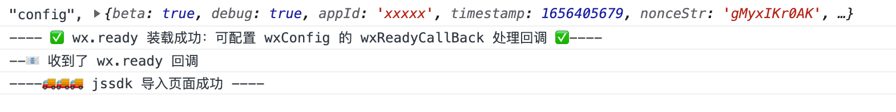

#  qy-sdk-setup
- jsSdk 的授权


# 如果使用
  ## 初始化
  ```js
  import RegisterWx from 'qy-sdk-steup.mini.js'
  const wxSDK = new RegisterWx({
    wxConfig:{
        debug:true, 
        appId:'xxxxx',
        ticket:'js ticket',
        jsApiList:[], //需要使用的 jsApi 
        wxReadyCallBack:()=>{
            //wx  ready 后执行的回调
        },
        wxFailCallBack:(err)=>{
            // wx error 的回调
        },
        .....
    }
  
})
  ```

 ## 需要调用jssdk 页面注册方法

  ```js
  RegisterWx().register()
  ``` 

## 注意
RegisterWx() 初次加载的时候 是一个异步的过程，所以如果是单页面建议在 工程入口进行初始化

## 通过 script 标签使用
```js
  <script  src="qy-sdk-steup.mini.js"></script></head>
  <script>
   new QySdkSteup.default({
    wxConfig:{
        debug:true, 
        appId:'xxxxx',
        ticket:'js ticket',
        jsApiList:[], //需要使用的 jsApi 
        wxReadyCallBack:()=>{
            //wx  ready 后执行的回调
            console.log('--📧 收到了 wx.ready 回调')
        },
        wxFailCallBack:(err)=>{
            // wx error 的回调
        },

    }
  
})

  </script>
</html>

```
## 说明
```
 wxConfig : {
     debug:true, 
        appId:'xxxxx',
        ticket:'js ticket',
        jsApiList:[], //需要使用的 jsApi 
        wxReadyCallBack:()=>{
            //wx  ready 后执行的回调
        },
        wxFailCallBack:(err)=>{
            // wx error 的回调
        },
 }
```

# 实现原理

# 控制台打印信息



# TODO
- 第三方服务商的授权

